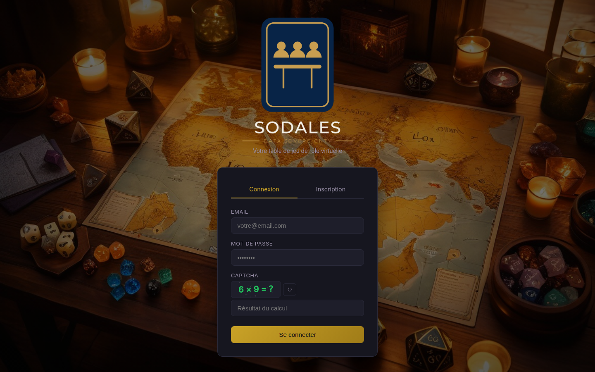
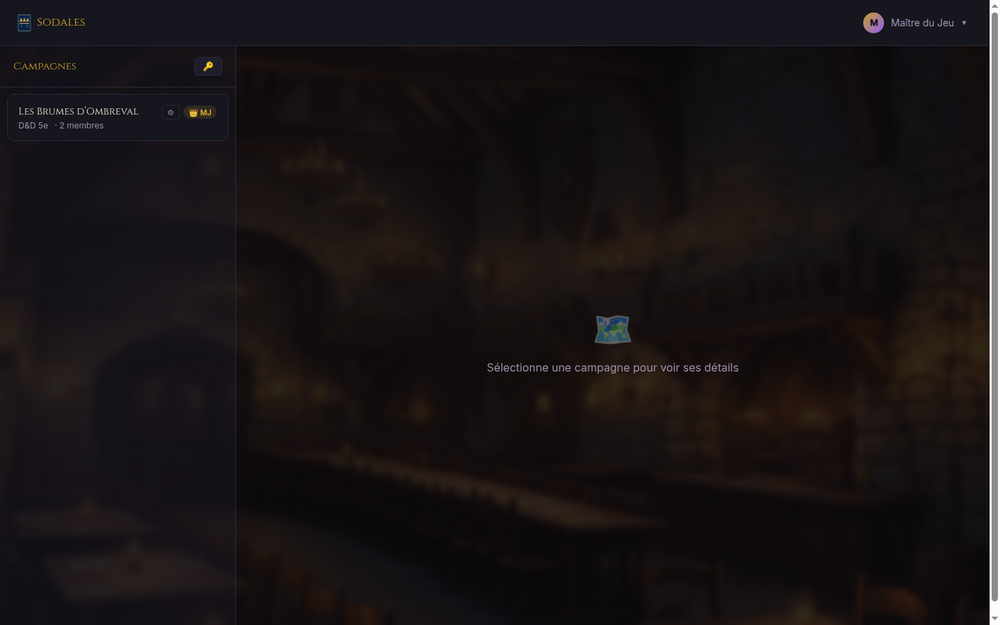
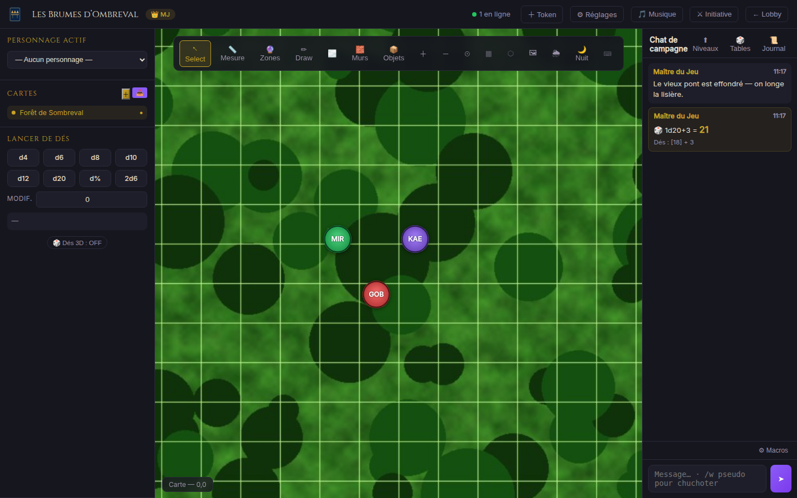

# Sodales

Self-hosted virtual tabletop (VTT) for tabletop RPG campaigns — interactive maps with fog of war, character sheets for 15 game systems, 3D dice and real-time play.

<picture>
  <source media="(prefers-color-scheme: dark)" srcset="frontend/img/sodales-lockup-dark.png">
  
</picture>

**Stack**: Node.js · Express · Socket.io · PostgreSQL · Docker · nginx

## Features

- Interactive maps with tokens, fog of war, walls and dynamic lighting
- Per-character vision system and line-of-sight targeting
- Full D&D 5e character sheets (stats, spells, inventory, subclasses)
- Character sheets for 15 game systems: D&D 5e, Pathfinder 2e, Warhammer Fantasy, Call of Cthulhu, Starfinder, Shadowrun, Vampire: The Masquerade, Cyberpunk Red, Savage Worlds, Dune, Star Wars, The Lord of the Rings, Paranoia, Tomorrow City, Cats! La Mascarade
- AI-generated portraits and animations for the playable races and classes of every system
- 3D dice with multiple visual themes, chat with private messages and macros
- Ambient music and weather effects
- Markdown campaign journal, shared handouts, random tables
- Leveling with GM approval (D&D 5e rules)
- UVTT map import

## Screenshots







## Installation

### Prerequisites

- A Linux server (Ubuntu 22.04 / Debian 12 recommended)
- Docker >= 20.10 with the Compose plugin
- Git

### Install

```bash
git clone https://github.com/LostInTheBugs/Sodales.git
cd Sodales
sudo ./install.sh
```

The script asks three questions at startup:

**Web server** — three options:
- Built-in Nginx (Docker) with automatic Let's Encrypt SSL — recommended for a fresh server
- Nginx or Apache already installed — the script prints the directives to add to your vhost
- No proxy — the backend is exposed directly on port 8007

**Database** — two options:
- Built-in PostgreSQL (Docker) — no configuration required
- Existing PostgreSQL (local or remote) — you provide the connection URL; the schema is applied automatically if `psql` is available

The script then automatically generates the secrets (JWT, DB password) and starts the application.

## Media assets

The heavy media files (character portraits, I2V videos, music tracks — ~95 MB) are
**not stored in git** so the repository stays light. They ship as a dedicated
[`assets-2026.09`](https://github.com/LostInTheBugs/Sodales/releases/tag/assets-2026.09)
GitHub release, and the installer fetches them for you:

```bash
./fetch-assets.sh          # called automatically by install.sh
```

The app runs fine without them (missing portraits / videos / music), so a plain
clone is enough for development. `SODALES_ASSETS_URL` overrides the download URL.

## Configuration

Copy the example file and edit the variables:

```bash
cp .env.example .env
nano .env
```

**Main environment variables:**

| Variable | Default | Description |
|---|---|---|
| `RPG_PORT` | `8007` | Backend listen port |
| `RPG_BIND` | `127.0.0.1` | Binding interface |
| `DATABASE_URL` | — | PostgreSQL connection URL |
| `JWT_SECRET` | — | JWT secret key (auto-generated) |
| `ALLOWED_ORIGIN` | — | Public URL for CORS |
| `DOMAIN` | — | Domain name |
| `COMPOSE_PROFILES` | `db,nginx` | Docker profiles: `db`, `nginx` |

**Dependencies:** Docker >= 20.10 with the Compose plugin, Git.

## Usage

```bash
# Install
sudo ./install.sh

# Update
sudo ./update.sh

# Logs
docker compose logs -f rpg

# Backup
docker exec rpg-db pg_dump -U rpg rpg > backup_$(date +%Y%m%d).sql
```

## Version

Current version: **2026.09.001**

[Release notes and GitHub releases](https://github.com/LostInTheBugs/Sodales/releases)

## Project structure

```
├── backend/          — REST API + Socket.io (Node.js)
│   ├── routes/       — REST endpoints
│   ├── socket/       — Real-time handlers
│   ├── middleware/   — JWT auth
│   └── schema.sql    — PostgreSQL schema
├── frontend/         — HTML/CSS/JS interface
├── nginx/            — nginx configuration (templates)
├── docs/             — Screenshots
├── docker-compose.yml
├── .env.example
└── install.sh        — Installation script
```

## Security

- `.env` is **never** committed (excluded by `.gitignore`)
- All secrets are randomly generated at installation
- HTTPS mandatory via Let's Encrypt
- JWT for authentication
- bcrypt password hashing, rate limiting and account lockout on authentication endpoints
- Upload validation (magic bytes, per-user quota)

## Development cost (LLM)

This project was built entirely through AI-assisted sessions (Hermes Agent, deepseek-v4-pro / deepseek-v4-flash). Usage so far (cumulative as of 2026-08-02):

| Metric | Value |
|---|---|
| Input tokens | 354 369 |
| Output tokens | 214 754 |
| **Total (input + output)** | **569 123** |
| Cache read (reused at reduced price) | 17 685 120 |
| API calls | 299 |
| **Estimated cost** | **≈ 0.41 USD** |

Full breakdown: [TOKENS.md](TOKENS.md).

## License

MIT — see [LICENSE](LICENSE).

## Trademarks & third-party content

Sodales is an unofficial, non-commercial project — not affiliated with, sponsored or
endorsed by any game publisher. Game system names referenced in the interface (D&D,
Pathfinder, Warhammer, Call of Cthulhu, Shadowrun, Vampire, Cyberpunk, Savage Worlds,
Dune, Star Wars, The Lord of the Rings, Paranoia…) are trademarks of their respective
owners and are used descriptively to describe the rules a table plays with. Character
illustrations shipped with the app are AI-generated and original to this project.

